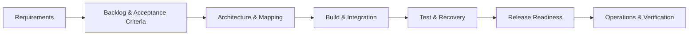
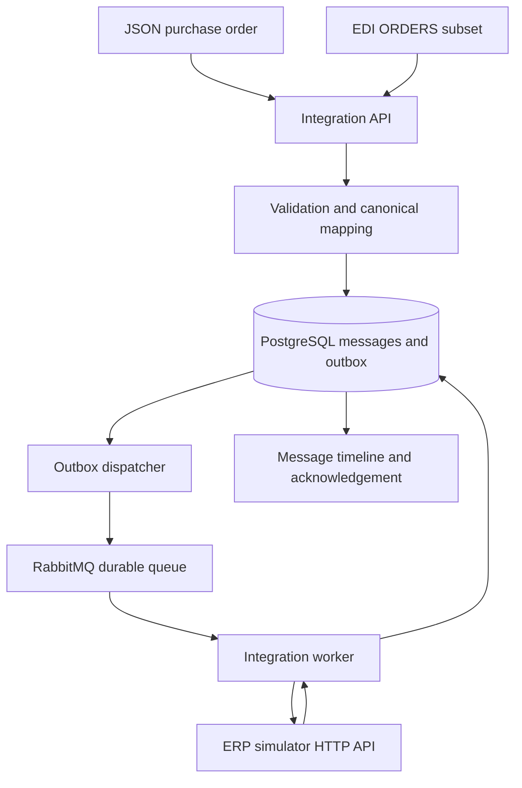

# Enterprise EDI Integration Delivery Platform

> **Project Delivery Case Study** — A fictional B2B integration delivered from requirements and acceptance criteria through architecture, implementation, testing, failure recovery, release readiness, and operational handover.

A runnable B2B order-to-cash integration built to demonstrate practical **integration delivery, project coordination, and execution discipline**.

Fictional **Nordic Retail GmbH** submits purchase orders to fictional **Atlas Consumer Products**. JSON and a deliberately limited EDIFACT-like ORDERS format converge on a canonical model, pass through RabbitMQ, and create an order in a separate HTTP ERP simulator.

This repository goes beyond the technical implementation. It includes the supporting delivery controls: **backlog, acceptance criteria, RAID register, release checklist, architecture documentation, test strategy, operational runbook, failure/recovery scenarios, and verification evidence.**

> **Portfolio disclosure:** This is a self-directed learning and portfolio implementation. It does not represent a real customer deployment, SAP implementation, EDI certification, or professional EDI project engagement. See [verification](docs/verification.md) for what has actually been tested.

---

## What This Project Demonstrates

| Delivery capability | Evidence |
|---|---|
| **Requirements & scope management** | [Backlog](delivery/backlog.md) and [acceptance criteria](delivery/acceptance-criteria.md) |
| **Risk & dependency management** | [RAID register](delivery/raid-register.md) |
| **Integration planning & design** | [Architecture](docs/architecture.md), [integration flow](docs/integration-flow.md), and [EDI mapping](docs/edi-mapping.md) |
| **Quality & validation** | [Testing strategy](docs/testing.md), automated tests, and controlled failure scenarios |
| **Release readiness** | [Release checklist](delivery/release-checklist.md) and [release runbook](docs/release-runbook.md) |
| **Operational handover** | [Operations runbook](docs/operations.md), dashboard, retry workflow, and audit trail |
| **Verification & traceability** | [Verification record](docs/verification.md) and live HTTP evidence |
| **Solution demonstration** | [Seven-minute demo](docs/demo-script.md) and [technical walkthrough](docs/technical-walkthrough.md) |

---

## Delivery Lifecycle



The project models the coordination concerns behind an integration delivery: defining what **done** means, translating requirements into acceptance criteria, tracking risks and dependencies, validating the integrated workflow, managing failure paths, preparing release controls, and documenting operational ownership.

---

## Business Scenario

A fictional retail customer needs to submit purchase orders to a supplier through two inbound formats:

- JSON API orders
- EDIFACT-like ORDERS messages

Both formats must be validated and converted into a common canonical order before downstream processing.

The workflow also needs to handle:

- invalid messages;
- duplicate orders;
- broker or downstream-service interruptions;
- message traceability;
- controlled retries and recovery;
- acknowledgement generation;
- release verification;
- operational visibility.

---

## Architecture



### Technology

**Python 3.12 · FastAPI · Pydantic · SQLAlchemy · PostgreSQL 17 · RabbitMQ 4 · Docker Compose · pytest · GitHub Actions**

The project also includes a plain HTML/JavaScript operational dashboard. Runtime and test dependencies are pinned in `requirements.lock`.

---

## Delivery Artifacts

The repository contains both the runnable solution and the artifacts used to structure and verify its delivery.

### Project Delivery

| Artifact | Purpose |
|---|---|
| [`delivery/backlog.md`](delivery/backlog.md) | Implementation backlog and work breakdown |
| [`delivery/acceptance-criteria.md`](delivery/acceptance-criteria.md) | Expected behaviour and definition of done |
| [`delivery/raid-register.md`](delivery/raid-register.md) | Risks, assumptions, issues, and dependencies |
| [`delivery/release-checklist.md`](delivery/release-checklist.md) | Release-readiness controls |
| [`delivery/azure-devops-backlog.md`](delivery/azure-devops-backlog.md) | Azure DevOps-style backlog representation |

### Solution, Quality & Operations

| Artifact | Purpose |
|---|---|
| [`docs/architecture.md`](docs/architecture.md) | Architecture decisions and schema lifecycle |
| [`docs/integration-flow.md`](docs/integration-flow.md) | End-to-end integration flow |
| [`docs/edi-mapping.md`](docs/edi-mapping.md) | Supported EDI subset and canonical mapping |
| [`docs/testing.md`](docs/testing.md) | Test strategy and verification approach |
| [`docs/operations.md`](docs/operations.md) | Operational runbook |
| [`docs/release-runbook.md`](docs/release-runbook.md) | Release procedure |
| [`docs/verification.md`](docs/verification.md) | Tested capabilities and evidence |
| [`docs/demo-script.md`](docs/demo-script.md) | Structured seven-minute demonstration |
| [`docs/technical-walkthrough.md`](docs/technical-walkthrough.md) | Detailed technical walkthrough |

---

## Quick Start

### Prerequisites

- Git
- Python 3.12+
- Docker with Compose v2

Run commands from the repository root.

```bash
git clone https://github.com/Sreejith4554/enterprise-edi-integration-delivery.git
cd enterprise-edi-integration-delivery
python scripts/configure.py
docker compose up --build
```

The configure command creates unique local credentials in ignored `.env` and refuses to overwrite an existing file.

For later starts:

```bash
docker compose up --build
```

PostgreSQL and RabbitMQ use persistent named volumes. Schema initialization runs once before application services start; see [schema lifecycle](docs/architecture.md).

### Local Interfaces

| Interface | Address |
|---|---|
| Operational dashboard | `http://localhost:8000` |
| Swagger API | `http://localhost:8000/docs` |
| Health endpoint | `http://localhost:8000/health` |
| RabbitMQ management | `http://localhost:15672` |

RabbitMQ uses user `integration`; the password comes from your `.env`.

API and management ports bind to loopback. The ERP has no host port.

API authentication is optional for this local demo: set `API_KEY` in `.env`, recreate services, and supply `X-API-Key` on every `/api/v1/` request. The dashboard has a password field for it.

**Do not expose this demo directly to the public internet.**

---

## Submit a JSON Order

```bash
curl -i http://localhost:8000/api/v1/orders \
  -H 'Content-Type: application/json' \
  --data-binary @examples/valid_order.json
```

Expected HTTP **202** after validation and transactional persistence:

```json
{
  "correlation_id": "<generated-uuid>",
  "status": "VALIDATED",
  "error": null
}
```

`VALIDATED` means the durable outbox awaits dispatch; it does **not** falsely claim that the broker has received the message.

The dispatcher changes the state to `QUEUED` only after publisher confirmation. The worker subsequently records `PROCESSING` and `COMPLETED`, together with an ERP ID, canonical payload, and acknowledgement.

```text
VALIDATED → QUEUED → PROCESSING → COMPLETED
```

### Query Message History

```bash
curl http://localhost:8000/api/v1/messages/REPLACE_WITH_CORRELATION_ID

curl 'http://localhost:8000/api/v1/messages?status=COMPLETED&source=JSON&customer=NORDIC-001&limit=20&offset=0'

curl http://localhost:8000/api/v1/metrics
```

The optional `date=2026-09-30` filter is a **UTC calendar date**.

History uses bounded pagination and returns total count. The detail endpoint shows raw input, normalized order, chronological audit events, retries, errors, and confirmation.

---

## EDI Input

```bash
curl -i http://localhost:8000/api/v1/edi/orders \
  -H 'Content-Type: text/plain' \
  --data-binary @examples/valid_order.edi
```

Example segments from the complete fixture:

```text
UNH+1+ORDERS:D:96A:UN'
BGM+220+PO-EDI-1001+9'
DTM+137:20260930:102'
NAD+BY+NORDIC-001'
LIN+1++ATLAS-100:SA'
QTY+21:12:EA'
PRI+AAA:24.50'
```

This excerpt alone is not a valid message. The complete sample supplies delivery date, address, currency, description, and a matching `UNT` count.

Read the exact supported subset in [edi-mapping.md](docs/edi-mapping.md).

The generated ORDRSP-style acknowledgement is stored under the same correlation ID. It is available for retrieval but is not automatically sent to a trading partner.

---

## Failure & Recovery

A successful happy path alone is not enough to demonstrate integration delivery. The project therefore includes validation failures, duplicate handling, downstream outages, correction, and recovery.

### Validation Failures

```bash
curl -i http://localhost:8000/api/v1/orders \
  -H 'Content-Type: application/json' \
  --data-binary @examples/invalid_order.json

curl -i http://localhost:8000/api/v1/edi/orders \
  -H 'Content-Type: text/plain' \
  --data-binary @examples/invalid_order.edi
```

Validation errors return **422 with a persisted correlation ID**.

Repeating the same valid customer/order pair returns **409**, records a separate failed attempt, and references the original message. Duplicate attempts cannot be retried.

### Correcting a Validation Failure

Open the failed message in the dashboard, paste a complete corrected payload in the original format, and select **Retry failed message**.

Alternatively, post:

```json
{
  "replacement_raw": "<complete corrected JSON or EDI text>"
}
```

to:

```text
/api/v1/messages/{id}/retry
```

The original payload and previous error remain in the timeline.

Use a unique external order ID to avoid colliding with previous examples.

### Technical Recovery

Stop the ERP simulator:

```bash
docker compose stop erp
```

Submit a new valid order and observe the retryable failure.

Restart it:

```bash
docker compose start erp
```

Then:

```bash
curl -X POST http://localhost:8000/api/v1/messages/REPLACE_WITH_CORRELATION_ID/retry
```

A maximum of three explicit retries is allowed by default. Technical retries cannot edit an already claimed order.

For an automated fresh-ID demonstration:

```bash
python -m pip install -r requirements.lock
python scripts/smoke.py --chaos
```

`--chaos` deliberately stops and restarts the ERP container in the local stack.

Without it, the smoke test leaves services running and covers JSON, EDI, duplicates, invalid input, correction, history, and acknowledgements.

---

## Testing & Verification

```bash
python -m pip install -r requirements.lock
python -m pytest -q
```

Or after startup:

```bash
docker compose run --rm \
  -e DATABASE_URL=sqlite:// \
  api python -m pytest -q
```

Tests override their database to an isolated temporary SQLite file; they never use the running demo database.

Unit/API tests use the actual ERP HTTP application through TestClient and a broker test double.

The **separate live smoke CI** builds the real Compose stack with PostgreSQL, RabbitMQ, dispatcher, worker, API, and HTTP ERP, then exercises a controlled ERP outage.

See [testing.md](docs/testing.md) and [verification.md](docs/verification.md).

---

## Key Delivery Decisions

### Transactional Outbox

Validated orders are persisted before broker publication.

This avoids reporting that an order has been queued before RabbitMQ has actually confirmed publication.

### Traceability

Each processing attempt receives a correlation ID, creating an auditable path through:

```text
Intake → Validation → Queue → Processing → ERP → Completion
```

### Idempotency & Duplicate Control

Duplicate customer/order combinations are detected to reduce duplicate downstream effects.

The ERP simulator's correlation-key uniqueness provides additional idempotent protection.

### Failure Visibility

Validation and technical failures are retained rather than silently discarded, allowing the operator to review the failure, preserve the original evidence, and perform an explicit retry where appropriate.

### Release & Operational Readiness

Testing, verification, release controls, operational documentation, and recovery procedures are maintained alongside the implementation rather than treated as afterthoughts.

---

## Repository Guide

| Path | Responsibility |
|---|---|
| `delivery/` | Backlog, acceptance criteria, RAID, and release controls |
| `docs/` | Architecture, mapping, testing, operations, release, verification, and demonstration documentation |
| `app/schemas.py`, `app/mapping.py` | Canonical schema, business checks, JSON/EDI mapping, acknowledgement |
| `app/main.py`, `app/dashboard.html` | Intake, history, retry, health, and operator dashboard |
| `app/service.py`, `app/db.py` | State transitions, audit, idempotency claims, relational persistence |
| `app/broker.py`, `app/worker.py`, `app/erp.py` | Transactional outbox, RabbitMQ consumer, separate ERP HTTP simulator |
| `tests/`, `scripts/smoke.py` | Isolated tests and real-infrastructure verification |
| `examples/` | Valid and invalid JSON/EDI fixtures |
| `.github/workflows/ci.yml` | Lint, tests, Compose smoke, and verification artifacts |

---

## Scope & Limitations

This is a **local learning and portfolio implementation**, not a production integration platform.

It does not provide full EDIFACT, AS2/SFTP, partner certificates, SAP connectivity, RBAC, production authentication, TLS, distributed tracing, stock/pricing negotiation, taxation, or invoice processing.

Canonical items and acknowledgements are JSON columns rather than separate normalized child tables. A customer/order key is permanently claimed after validation.

PostgreSQL row locks make concurrent workers safe; SQLite tests are not a distributed deployment option.

Delivery is **at least once**, not exactly once. The ERP's correlation-key uniqueness supplies idempotent effects.

`PROCESSING` is committed together with the final result and is visible in the completed timeline; a live observer generally sees `QUEUED` during the short ERP call.

Broker outages keep orders `VALIDATED` in the outbox. They are logged as dispatcher failures rather than being misclassified as failed customer orders.

No retention/PII-deletion policy is implemented. Transport/auth/body-size errors are rejected before message creation.

Version 1 initializes a fresh schema via `create_all`; it does not automatically migrate future schema changes.

---

## Suggested Review Path

For a quick portfolio review:

**1. Delivery approach**  
[Backlog](delivery/backlog.md) → [Acceptance criteria](delivery/acceptance-criteria.md) → [RAID register](delivery/raid-register.md)

**2. Solution design**  
[Architecture](docs/architecture.md) → [Integration flow](docs/integration-flow.md) → [EDI mapping](docs/edi-mapping.md)

**3. Quality & release**  
[Testing](docs/testing.md) → [Release checklist](delivery/release-checklist.md) → [Verification](docs/verification.md)

**4. Operations**  
[Operational runbook](docs/operations.md)

**5. Demonstration**  
[Seven-minute demo](docs/demo-script.md) → [Technical walkthrough](docs/technical-walkthrough.md)

---

## Project Objective

The purpose of this project is **not to present myself as an EDI developer or claim production integration experience**.

It demonstrates how I approach a technically complex delivery:

**Requirements → Acceptance Criteria → Risk & Dependency Management → Implementation → Integrated Testing → Failure Recovery → Release Readiness → Operational Handover → Verification**

The focus is the combination of **technical understanding and structured project delivery**.
