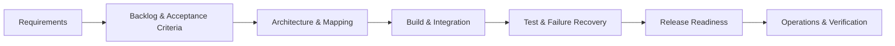
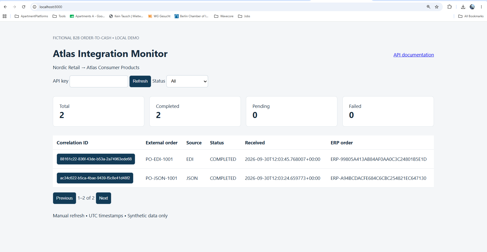
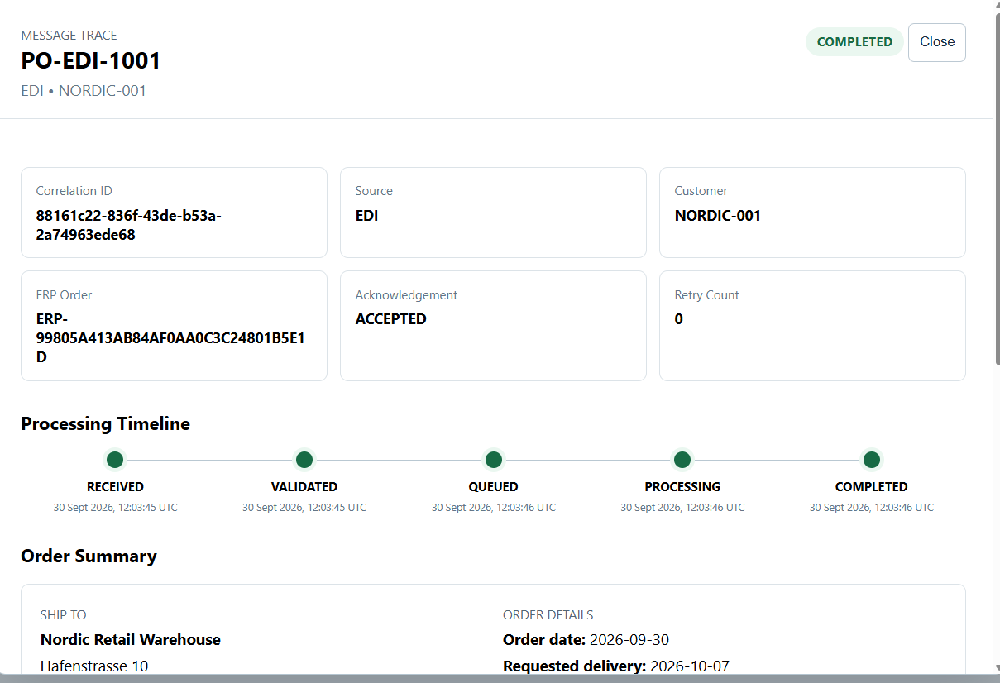
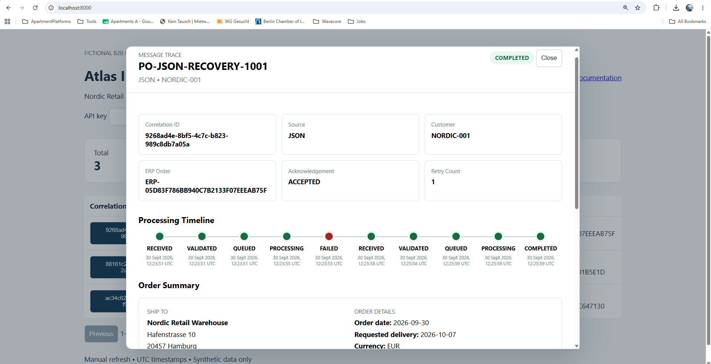
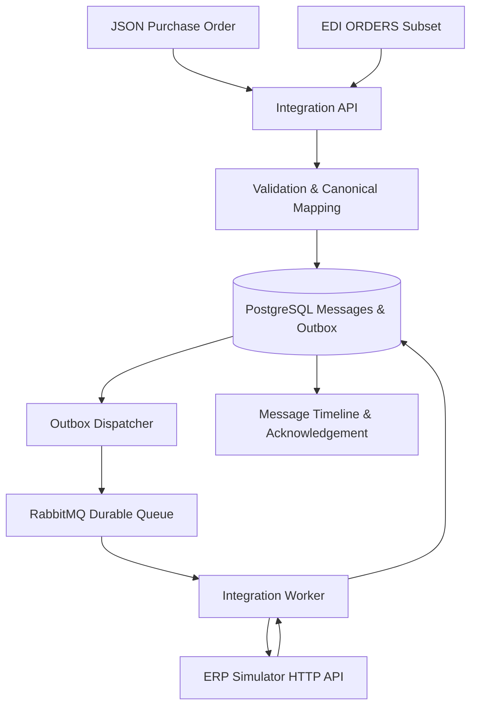

# Enterprise EDI Integration Delivery Platform

> **Project delivery case study:** taking a fictional B2B order integration from requirements and acceptance criteria through implementation, testing, release readiness, operational recovery, and verification.

A runnable B2B order-to-cash integration built to demonstrate practical **integration delivery, project coordination, and execution discipline**.

In this scenario, fictional **Nordic Retail GmbH** submits purchase orders to fictional **Atlas Consumer Products**. JSON and a deliberately limited EDIFACT-like ORDERS format converge on a canonical model, pass through RabbitMQ, and create an order in a separate HTTP ERP simulator.

This repository is intentionally more than an application. It includes the delivery controls surrounding the technical solution: **backlog, acceptance criteria, RAID register, release checklist, architecture documentation, testing strategy, operational runbook, failure/recovery scenarios, and verification evidence.**

> **Portfolio disclosure:** This is a self-directed learning and portfolio implementation. It does not represent a real customer deployment, SAP implementation, EDI certification, or professional project engagement. See [verification](docs/verification.md) for what has actually been tested.

---

## What This Project Demonstrates

| Delivery Area | Evidence in This Repository |
|---|---|
| Requirements & scope management | Backlog and explicit acceptance criteria |
| Risk & dependency management | RAID register |
| Integration planning & design | Architecture, integration flow, EDI mapping |
| Quality & validation | Automated tests, testing strategy, controlled failure scenarios |
| Release readiness | Release checklist and release runbook |
| Operational handover | Operations runbook, monitoring dashboard, retries and audit trail |
| Verification & traceability | Verification record, correlation IDs and live HTTP evidence |
| Stakeholder-style demonstration | Seven-minute demo and technical walkthrough |

The project is structured around the **delivery lifecycle**, not only the application code.

---

## Delivery Lifecycle



The delivery approach was to define what “done” means before implementation, translate requirements into acceptance criteria, identify risks and dependencies, validate the integrated workflow, test failure paths, prepare release controls, and document operational ownership.

---

## Business Scenario

A fictional retailer, **Nordic Retail GmbH**, needs to submit purchase orders to fictional **Atlas Consumer Products**.

Orders may arrive as:

- JSON through an HTTP API
- A deliberately limited EDIFACT-like ORDERS message

Both formats are transformed into a shared canonical order model before downstream processing.

The workflow needs to handle:

- Valid and invalid messages
- Duplicate orders
- Broker and downstream interruptions
- End-to-end correlation and traceability
- Explicit retry controls
- Order acknowledgements
- Release verification
- Operational monitoring

The downstream ERP is represented by a separate HTTP simulator so that the integration can be tested end-to-end without claiming connectivity to a real enterprise ERP platform.

---

## Solution Preview

### Operational Monitoring

The operational dashboard provides a consolidated view of integration activity, including message volumes, processing status, source format, correlation IDs, and downstream ERP order references.



*Operational view showing successful JSON and EDI order processing with end-to-end correlation and ERP references.*

### End-to-End Message Traceability

Each transaction maintains a correlation ID and chronological processing history from intake through downstream completion.



*EDI order progressing through RECEIVED → VALIDATED → QUEUED → PROCESSING → COMPLETED, with ERP confirmation and acknowledgement.*

### Failure Recovery & Operational Control

The workflow was tested against a controlled downstream ERP outage. The failed transaction remained traceable and was successfully recovered through an explicit retry after the ERP service was restored.



*Controlled recovery scenario preserving the original FAILED event while recording the successful retry through to COMPLETED. Retry Count = 1.*

---

## Architecture



### Technology Stack

- Python 3.12
- FastAPI
- Pydantic
- SQLAlchemy
- PostgreSQL 17
- RabbitMQ 4
- Docker Compose
- pytest
- HTML/JavaScript operational dashboard
- GitHub Actions

Runtime and test dependencies are pinned in `requirements.lock`.

---

## Delivery Artifacts

The repository contains project-delivery documentation alongside the implementation.

### `delivery/`

| Artifact | Purpose |
|---|---|
| `backlog.md` | Delivery backlog and work breakdown |
| `azure-devops-backlog.md` | Backlog structured for work-management tooling |
| `acceptance-criteria.md` | Definition of expected functional behaviour |
| `raid-register.md` | Risks, assumptions, issues and dependencies |
| `release-checklist.md` | Release-readiness controls |

### `docs/`

| Artifact | Purpose |
|---|---|
| `architecture.md` | Architecture decisions and system boundaries |
| `integration-flow.md` | End-to-end message flow |
| `edi-mapping.md` | Supported EDI subset and mapping |
| `testing.md` | Test strategy and validation approach |
| `operations.md` | Operational monitoring and recovery |
| `release-runbook.md` | Controlled release procedure |
| `verification.md` | What has actually been verified |
| `demo-script.md` | Seven-minute stakeholder-style demonstration |
| `technical-walkthrough.md` | Detailed technical walkthrough |
| `live-http-evidence.json` | Recorded HTTP verification evidence |

---

## Quick Start

### Prerequisites

- Git
- Python 3.12+
- Docker with Compose v2

Run commands from the repository root.

```bash
git clone https://github.com/Sreejith4554/enterprise-edi-integration-delivery.git
cd enterprise-edi-integration-delivery
python scripts/configure.py
docker compose up --build
```

The configuration command creates unique local credentials in an ignored `.env` file and refuses to overwrite an existing configuration.

For subsequent starts:

```bash
docker compose up --build
```

PostgreSQL and RabbitMQ use persistent named volumes. Schema initialization runs before the application services start.

See [architecture.md](docs/architecture.md) for the schema lifecycle.

### Local Interfaces

| Interface | Address |
|---|---|
| Operational Dashboard | `http://localhost:8000` |
| Swagger / API Documentation | `http://localhost:8000/docs` |
| Health Endpoint | `http://localhost:8000/health` |
| RabbitMQ Management | `http://localhost:15672` |

RabbitMQ uses the local `integration` user and the password generated in `.env`.

API and management ports bind to loopback. The ERP simulator has no host port.

API authentication is optional for the local demo. Set `API_KEY` in `.env`, recreate the services, and supply `X-API-Key` on `/api/v1/` requests.

The dashboard provides a field for the API key.

**Do not expose this local demonstration environment to the public internet.**

---

## Submit a JSON Order

```bash
curl -i http://localhost:8000/api/v1/orders \
  -H 'Content-Type: application/json' \
  --data-binary @examples/valid_order.json
```

Expected response:

```json
{
  "correlation_id": "<generated-uuid>",
  "status": "VALIDATED",
  "error": null
}
```

HTTP **202 Accepted** indicates that the message has passed intake validation and has been durably persisted.

`VALIDATED` deliberately does not imply that RabbitMQ has already received the message.

The transactional outbox dispatcher subsequently moves the transaction through:

```text
VALIDATED
   ↓
QUEUED
   ↓
PROCESSING
   ↓
COMPLETED
```

The worker records the downstream ERP order ID, canonical payload, acknowledgement and processing events.

### Query a Message

```bash
curl http://localhost:8000/api/v1/messages/REPLACE_WITH_CORRELATION_ID
```

### Query Message History

```bash
curl 'http://localhost:8000/api/v1/messages?status=COMPLETED&source=JSON&customer=NORDIC-001&limit=20&offset=0'
```

### Metrics

```bash
curl http://localhost:8000/api/v1/metrics
```

The optional `date=2026-09-30` filter represents a **UTC calendar date**.

Message detail provides:

- Raw input
- Canonical order
- Correlation ID
- Chronological processing events
- Retry history
- Errors
- ERP confirmation
- Acknowledgement

---

## EDI Input

Submit the sample EDI order:

```bash
curl -i http://localhost:8000/api/v1/edi/orders \
  -H 'Content-Type: text/plain' \
  --data-binary @examples/valid_order.edi
```

Example segments from the complete fixture:

```text
UNH+1+ORDERS:D:96A:UN'
BGM+220+PO-EDI-1001+9'
DTM+137:20260930:102'
NAD+BY+NORDIC-001'
LIN+1++ATLAS-100:SA'
QTY+21:12:EA'
PRI+AAA:24.50'
```

This excerpt alone is not a valid complete message. The full sample also supplies delivery date, address, currency, description and a matching `UNT` count.

See [edi-mapping.md](docs/edi-mapping.md) for the exact supported subset.

A successful transaction produces an ORDRSP-style acknowledgement associated with the same correlation ID.

The acknowledgement is stored and available for retrieval. It is **not automatically transmitted to a real trading partner**.

---

## Failure & Recovery

Failure handling is intentionally visible rather than hidden.

### Validation Failures

```bash
curl -i http://localhost:8000/api/v1/orders \
  -H 'Content-Type: application/json' \
  --data-binary @examples/invalid_order.json
```

```bash
curl -i http://localhost:8000/api/v1/edi/orders \
  -H 'Content-Type: text/plain' \
  --data-binary @examples/invalid_order.edi
```

Validation failures return HTTP **422** with a persisted correlation ID.

### Duplicate Protection

Repeating an already accepted customer/order pair returns HTTP **409**.

The duplicate attempt is recorded separately and references the original transaction.

Duplicate attempts cannot be retried as new orders.

### Correcting Validation Failures

Open the failed transaction in the operational dashboard, provide a complete corrected payload in the original format, and select:

**Retry failed message**

Alternatively:

```bash
curl -X POST \
  http://localhost:8000/api/v1/messages/REPLACE_WITH_CORRELATION_ID/retry \
  -H 'Content-Type: application/json' \
  -d '{"replacement_raw":"<complete corrected JSON or EDI text>"}'
```

The original payload and previous error remain in the message history.

---

## Controlled ERP Outage & Recovery

A downstream failure can be reproduced without changing the application code.

A dedicated synthetic fixture is available:

```text
examples/recovery_order.json
```

### 1. Stop the ERP simulator

```bash
docker compose stop erp
```

### 2. Submit the recovery order

```bash
curl -i http://localhost:8000/api/v1/orders \
  -H 'Content-Type: application/json' \
  --data-binary @examples/recovery_order.json
```

The API can still accept and persist the order because intake is decoupled from downstream ERP processing.

The transaction subsequently records the failed downstream attempt:

```text
RECEIVED
   ↓
VALIDATED
   ↓
QUEUED
   ↓
PROCESSING
   ↓
FAILED
```

### 3. Restore the ERP

```bash
docker compose start erp
```

### 4. Retry the failed transaction

Use **Retry failed message** in the operational dashboard without supplying a replacement payload, or call:

```bash
curl -X POST \
  http://localhost:8000/api/v1/messages/REPLACE_WITH_CORRELATION_ID/retry \
  -H 'Content-Type: application/json' \
  -d '{}'
```

After successful recovery, the same transaction retains its previous failure history and records the new processing attempt:

```text
RECEIVED → VALIDATED → QUEUED → PROCESSING → FAILED
                                              ↓
RECEIVED → VALIDATED → QUEUED → PROCESSING → COMPLETED
```

The verified local demonstration produced:

- Original downstream failure retained in the audit history
- Retry count incremented
- Successful ERP order creation after recovery
- `ACCEPTED` acknowledgement
- Final `COMPLETED` status

This scenario demonstrates operational traceability rather than simply replacing the failed record with a successful one.

Maximum three explicit retries are allowed by default.

---

## Automated End-to-End Demonstration

Install the pinned dependencies:

```bash
python -m pip install -r requirements.lock
```

Run:

```bash
python scripts/smoke.py --chaos
```

`--chaos` deliberately stops and restarts the ERP container in the local Compose environment.

Without `--chaos`, the smoke workflow leaves the services running and covers:

- JSON input
- EDI input
- Duplicate handling
- Invalid input
- Correction workflow
- Message history
- Acknowledgements

---

## Testing & Quality Controls

Install dependencies:

```bash
python -m pip install -r requirements.lock
```

Run the automated tests:

```bash
python -m pytest -q
```

Alternatively, after the Compose environment is running:

```bash
docker compose run --rm \
  -e DATABASE_URL=sqlite:// \
  api python -m pytest -q
```

The test suite uses an isolated temporary SQLite database and does not use the running demonstration database.

Unit/API tests use:

- FastAPI TestClient
- ERP HTTP application
- Broker test double
- Isolated database state

A separate live smoke workflow exercises the actual Compose environment with:

- PostgreSQL
- RabbitMQ
- Dispatcher
- Worker
- Integration API
- HTTP ERP simulator
- Controlled ERP outage

See [testing.md](docs/testing.md) for the complete testing approach.

---

## Repository Guide

| Path | Responsibility |
|---|---|
| `app/schemas.py`, `app/mapping.py` | Canonical schema, business validation, JSON/EDI mapping and acknowledgement |
| `app/main.py` | API intake, history, retry, health and dashboard delivery |
| `app/dashboard.html` | Operational monitoring, message traceability and recovery interface |
| `app/service.py`, `app/db.py` | State transitions, audit history, idempotency and relational persistence |
| `app/broker.py`, `app/worker.py`, `app/erp.py` | Transactional outbox, RabbitMQ consumer and ERP HTTP simulator |
| `tests/` | Isolated automated tests |
| `scripts/smoke.py` | Live infrastructure and failure-recovery verification |
| `examples/` | Valid, invalid and recovery JSON/EDI fixtures |
| `docs/images/` | Verified operational screenshots used in this README |
| `docs/` | Architecture, mapping, operations, testing, release and verification documentation |
| `delivery/` | Backlog, acceptance criteria, RAID register and release controls |
| `.github/workflows/ci.yml` | Linting, tests, Compose smoke testing and verification artifacts |

---

## Key Delivery Decisions

### Transactional Outbox

An accepted order is persisted before publication to RabbitMQ.

This reduces the risk of acknowledging an order at the API boundary and then losing it between database persistence and broker publication.

### Correlation & Audit Trail

Every accepted or rejected business message receives a correlation ID.

The message history records processing events so the operational path can be reconstructed.

### Idempotency

The customer/order combination is claimed to prevent duplicate business orders from silently creating duplicate downstream effects.

### Failure Visibility

Technical and validation failures are persisted and visible through the operational interface.

Failures are therefore treated as operational states requiring explicit handling rather than disappearing into application logs.

### Controlled Retry

Retries are explicit, bounded and auditable.

A technical failure can be retried without altering the business payload, while validation failures can be corrected using a replacement payload.

### Release Evidence

Release readiness is supported by:

- Acceptance criteria
- Automated tests
- Live smoke verification
- Release checklist
- Release runbook
- Operational documentation
- Demonstrated failure/recovery scenario

---

## Suggested Review Path

For a quick review of the project:

1. Start with this README and the **Solution Preview**
2. Review [`delivery/acceptance-criteria.md`](delivery/acceptance-criteria.md)
3. Review [`delivery/raid-register.md`](delivery/raid-register.md)
4. Review [`docs/architecture.md`](docs/architecture.md)
5. Review [`docs/testing.md`](docs/testing.md)
6. Review [`delivery/release-checklist.md`](delivery/release-checklist.md)
7. Review [`docs/operations.md`](docs/operations.md)
8. Run [`docs/demo-script.md`](docs/demo-script.md)
9. Check [`docs/verification.md`](docs/verification.md)

This sequence shows the project from **delivery definition → technical solution → validation → release → operations**.

---

## Scope & Limitations

This is a **local portfolio and learning implementation**, not a production integration platform.

It does not provide:

- Full EDIFACT support
- AS2 or SFTP transport
- Trading-partner certificates
- SAP connectivity
- Production RBAC
- Production authentication architecture
- TLS termination
- Distributed tracing
- Stock or pricing negotiation
- Taxation processing
- Invoice processing
- Production retention or PII-deletion controls

The EDI parser intentionally supports only the documented subset required for this scenario.

Canonical items and acknowledgements are stored as JSON columns rather than separate normalized child tables.

A customer/order key is permanently claimed after validation.

PostgreSQL row locking is used for concurrent worker safety. SQLite is used only for isolated tests and is not presented as a distributed deployment option.

Delivery semantics are **at least once**, not exactly once.

The ERP simulator's correlation-key uniqueness provides idempotent downstream effects.

`PROCESSING` is committed together with the final result and remains visible in the completed audit timeline. During the short ERP request, a live observer will generally see `QUEUED`.

Broker outages keep orders in `VALIDATED` through the transactional outbox rather than misclassifying them as failed customer orders.

Transport, authentication and body-size errors are rejected before business-message creation.

Version 1 initializes a fresh schema using `create_all`; automatic migration of future schema changes is outside the current scope.

---

## Project Objective

The objective of this project is **not** to present myself as an EDI developer or claim production integration experience.

It is to demonstrate how I approach a technically complex delivery:

**structure the requirements → define acceptance criteria → identify risks → coordinate implementation → validate the integrated workflow → manage failure scenarios → prepare release controls → document operations → verify the result**

That delivery mindset is the core of this portfolio project.