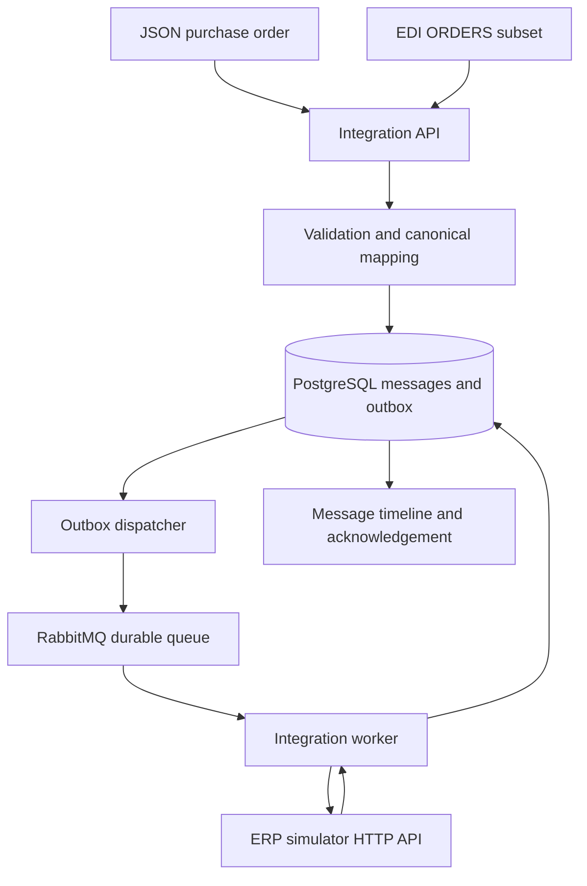

# Enterprise EDI Integration Delivery Platform

A runnable B2B order-to-cash integration built to develop and demonstrate practical integration-delivery knowledge. Fictional **Nordic Retail GmbH** submits purchase orders to fictional **Atlas Consumer Products**. JSON and a deliberately limited EDIFACT-like ORDERS format converge on one canonical model, pass through RabbitMQ, and create an order in a separate HTTP ERP simulator.

**No SAP connection, real customer data, EDI certification, or professional project-experience claim.** See [verification](docs/verification.md) for what has actually been tested.

## Architecture



Python 3.12, FastAPI, Pydantic, SQLAlchemy, PostgreSQL 17, RabbitMQ 4, Docker Compose, pytest and a plain HTML/JavaScript operational dashboard. Runtime and test dependencies are pinned in `requirements.lock`.

## Quick start

Prerequisites: Git, Python 3.12+ (only for configuration/smoke commands), Docker with Compose v2. Run commands from the repository root.

```bash
git clone https://github.com/Sreejith4554/enterprise-edi-integration-delivery.git
cd enterprise-edi-integration-delivery
python scripts/configure.py
docker compose up --build
```

The configure command creates unique local credentials in ignored `.env` and refuses to overwrite an existing file. For later starts, use only `docker compose up --build`. PostgreSQL and RabbitMQ use persistent named volumes. Schema initialization runs once before application services start; see [schema lifecycle](docs/architecture.md).

- Dashboard: http://localhost:8000
- Swagger: http://localhost:8000/docs
- Health: http://localhost:8000/health
- RabbitMQ management: http://localhost:15672 (user `integration`, password from your `.env`)

API and management ports bind to loopback. The ERP has no host port. API authentication is optional for this local demo: set `API_KEY` in `.env`, recreate services, and supply `X-API-Key` on every `/api/v1/` request. The dashboard has a password field for it. Do not expose this demo to the public internet.

## Submit an order

```bash
curl -i http://localhost:8000/api/v1/orders \
  -H 'Content-Type: application/json' --data-binary @examples/valid_order.json
```

Expected HTTP **202** after validation and transactional persistence:

```json
{"correlation_id":"<generated-uuid>","status":"VALIDATED","error":null}
```

`VALIDATED` means the durable outbox awaits dispatch; it does not falsely claim the broker has received the message. The dispatcher changes it to `QUEUED` only after a publisher confirmation. The worker records `PROCESSING` and `COMPLETED`, an ERP ID, canonical payload and acknowledgement.

```bash
curl http://localhost:8000/api/v1/messages/REPLACE_WITH_CORRELATION_ID
curl 'http://localhost:8000/api/v1/messages?status=COMPLETED&source=JSON&customer=NORDIC-001&limit=20&offset=0'
curl http://localhost:8000/api/v1/metrics
```

The optional `date=2026-09-30` filter is a **UTC calendar date**. History uses bounded pagination and returns total count. The detail endpoint shows raw input, normalized order, chronological audit events, retries, errors and confirmation.

## EDI input

```bash
curl -i http://localhost:8000/api/v1/edi/orders \
  -H 'Content-Type: text/plain' --data-binary @examples/valid_order.edi
```

Example segments from the complete fixture:

```text
UNH+1+ORDERS:D:96A:UN'
BGM+220+PO-EDI-1001+9'
DTM+137:20260930:102'
NAD+BY+NORDIC-001'
LIN+1++ATLAS-100:SA'
QTY+21:12:EA'
PRI+AAA:24.50'
```

This excerpt alone is not a valid message: the full sample supplies delivery date, address, currency, description and a matching `UNT` count. Read the exact supported subset in [edi-mapping.md](docs/edi-mapping.md). The generated ORDRSP-style acknowledgement is stored under the same correlation ID; it is available for retrieval, not automatically sent to a trading partner.

## Failure and recovery

```bash
curl -i http://localhost:8000/api/v1/orders \
  -H 'Content-Type: application/json' --data-binary @examples/invalid_order.json
curl -i http://localhost:8000/api/v1/edi/orders \
  -H 'Content-Type: text/plain' --data-binary @examples/invalid_order.edi
```

Validation errors return **422 with a persisted correlation ID**. Repeating the same valid customer/order pair returns **409**, records a separate failed attempt, and references the original message. Duplicate attempts cannot be retried.

To correct a validation failure, open its dashboard detail, paste a complete corrected payload in the original format, then click **Retry failed message**. Or post `{"replacement_raw":"<complete corrected JSON or EDI text>"}` to `/api/v1/messages/{id}/retry`. Original payload and previous error remain in the timeline. Use a unique external order ID to avoid colliding with previous examples.

For technical recovery, stop the simulator (`docker compose stop erp`), submit a new valid order, and observe a retryable failure. Start it (`docker compose start erp`), wait for startup, then:

```bash
curl -X POST http://localhost:8000/api/v1/messages/REPLACE_WITH_CORRELATION_ID/retry
```

Maximum three explicit retries by default. Technical retries cannot edit an already-claimed order. For a fully automated fresh-ID demonstration:

```bash
python -m pip install -r requirements.lock
python scripts/smoke.py --chaos
```

`--chaos` deliberately stops/restarts the ERP container in this local stack. Without it, the smoke test leaves services running and covers JSON, EDI, duplicates, invalid input, correction, history and acknowledgements.

## Tests

```bash
python -m pip install -r requirements.lock
python -m pytest -q
```

Or, after startup: `docker compose run --rm -e DATABASE_URL=sqlite:// api python -m pytest -q`. Tests override their database to an isolated temporary SQLite file; they never use the running demo database. Unit/API tests use the actual ERP HTTP application through TestClient and a broker test double. The **separate live smoke CI** builds the real Compose stack with PostgreSQL, RabbitMQ, dispatcher, worker, API and HTTP ERP, then exercises a controlled ERP outage. See [testing.md](docs/testing.md).

## Repository guide

| Path | Responsibility |
|---|---|
| `app/schemas.py`, `mapping.py` | Canonical schema, business checks, JSON/EDI mapping, acknowledgement |
| `app/main.py`, `dashboard.html` | Intake, history, retry, health and operator dashboard |
| `app/service.py`, `db.py` | State transitions, audit, idempotency claims, relational persistence |
| `app/broker.py`, `worker.py`, `erp.py` | Transactional outbox, RabbitMQ consumer, separate ERP HTTP simulator |
| `tests/`, `scripts/smoke.py` | Isolated tests and real infrastructure verification |
| `examples/` | Valid and invalid JSON/EDI fixtures |
| `docs/` | Architecture, mapping, operations, release, demo and learning guide |
| `delivery/` | Evidence-linked backlog, acceptance criteria, risks and release checklist |
| `.github/workflows/ci.yml` | Lint, tests, Compose smoke, verification artifacts |

## Scope and limitations

This is a local learning implementation. It does not provide full EDIFACT, AS2/SFTP, partner certificates, SAP connectivity, RBAC, production authentication, TLS, distributed tracing, stock/pricing negotiation, taxation or invoice processing. Canonical items and acknowledgements are JSON columns, not separate normalized child tables. A customer/order key is permanently claimed after validation. PostgreSQL row locks make concurrent workers safe; SQLite tests are not a distributed deployment option. Delivery is at least once, not exactly once. The ERP's correlation-key uniqueness supplies idempotent effects.

`PROCESSING` is committed together with the final result and is visible in the completed timeline; a live observer generally sees `QUEUED` during the short ERP call. Broker outages keep orders `VALIDATED` in the outbox; they are logged as dispatcher failures, not misclassified as failed customer orders. No retention/PII-deletion policy is implemented. Transport/auth/body-size errors are rejected before message creation. Version 1 initializes a fresh schema via `create_all`; it does not migrate future schema changes automatically.

Start with [the seven-minute demo](docs/demo-script.md), [technical walkthrough](docs/technical-walkthrough.md) and [operational runbook](docs/operations.md).
