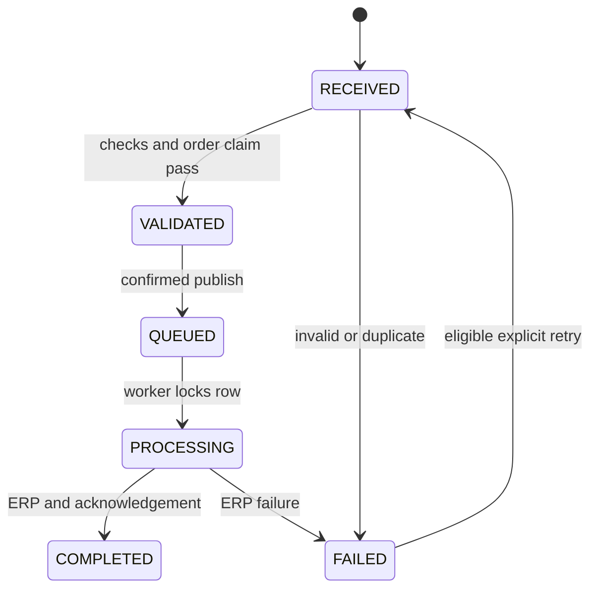

# Architecture and data ownership

The API authenticates and limits request size, then stores raw UTF-8 input before application validation. `mapping.map_order` converts JSON or the documented ORDERS subset to `CanonicalPurchaseOrder`. Pydantic validates types, Decimal precision, unique lines and dates; business checks recognize customer NORDIC-001 and products ATLAS-100/200. Descriptions and prices are caller-supplied synthetic data, not verified against a price master.

`service.validate_and_queue` reserves a unique customer/order key, records VALIDATED and inserts an outbox row in the **same database transaction**. Broker unavailability cannot lose an accepted order. `broker.dispatch_once` locks unpublished rows and message rows, publishes persistent messages to a durable queue with publisher confirms, then records QUEUED and publication time. A crash after publish but before SQL commit may republish; this is intentional at-least-once delivery.

The worker locks one message row with PostgreSQL `FOR UPDATE`, checks status and generation, calls the separate ERP process with an internal key, stores the acknowledgement and commits. RabbitMQ is acknowledged only afterward. ERP orders have a unique correlation key and canonical payload comparison, making a replay safe if the worker dies after the ERP committed. Duplicate workers serialize on the message lock. Stale envelopes from an earlier retry generation are ignored. The dispatcher uses `SKIP LOCKED` for concurrent dispatchers.

## Tables

| Table | Stored data / constraint |
|---|---|
| integration_messages | UUID, source, current raw payload, canonical JSON, state, error, acknowledgement JSON, ERP ID, retries, generation and timestamps |
| processing_events | Ordered audit ID, message UUID, timestamp, status and details; corrected payload events preserve previous raw text |
| order_claims | Primary key `customer:external_order`, unique owning message ID |
| outbox | Message ID, generation, nullable publisher-confirmed timestamp |
| erp_orders | Random collision-resistant ERP ID, unique correlation key, canonical JSON, creation time |

Canonical items are embedded JSON, avoiding redundant item-table synchronization in a small demonstrator. ORM-managed associations use indexed identifiers rather than database foreign keys; external APIs cannot delete records. A production schema should add explicit foreign keys and ownership/retention rules before adding deletion features.

## States

PROCESSING and final result are part of one short transaction; the event survives on completion, but intermediate PROCESSING is not normally observable from another transaction. Holding a DB connection through the bounded 10-second HTTP call is a deliberate small-demo trade-off. Unexpected worker exceptions roll back and reconnect; poison messages caused by code defects require an operator fix, and a production deployment needs dead-letter routing/backoff limits.

## Schema lifecycle

`python -m app.db` runs SQLAlchemy `create_all`, idempotently creating the version-one schema. Compose runs a single init service after PostgreSQL readiness; applications wait for its successful exit. This is reliable fresh initialization, **not versioned migration**. Future schema-changing releases require reviewed migrations and backup/restore validation; do not expect create_all to alter existing tables.

## Boundaries

The ERP is a separate HTTP service but shares one PostgreSQL database for demo economy and uses only erp_orders. A production ERP would own its own datastore and credentials. No in-memory queue substitutes for RabbitMQ in Compose. Unit tests substitute only transport edges; the smoke test uses actual services.
