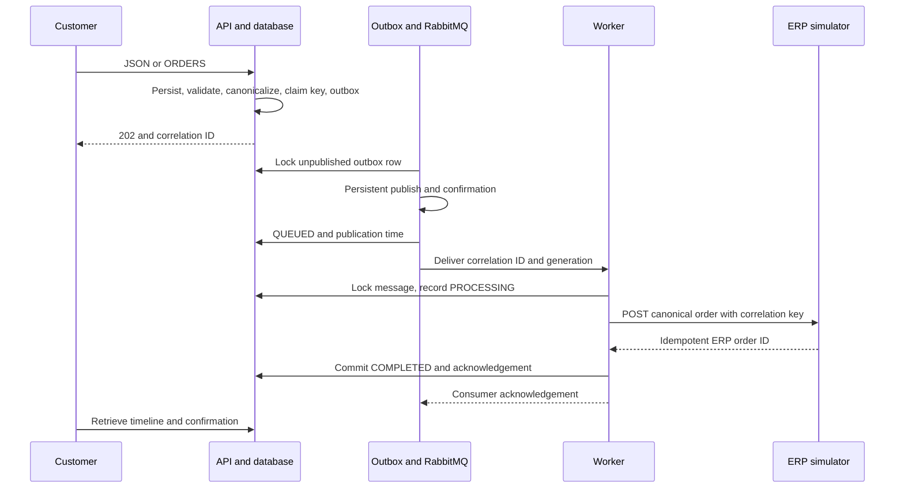
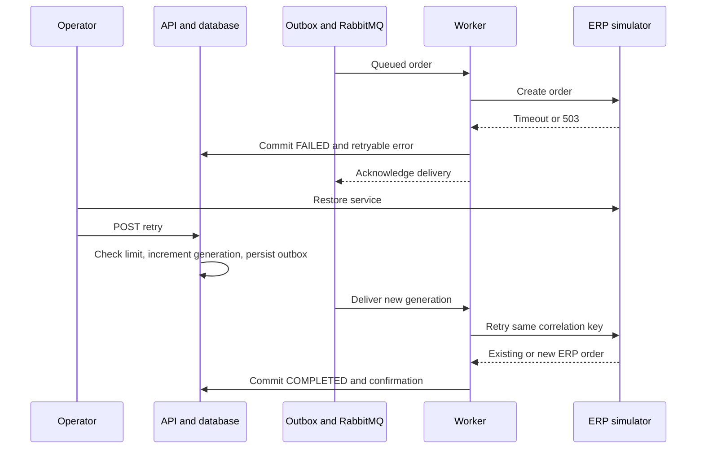

# Integration flows

## Success

## Failure and operator recovery

For invalid input, intake returns 422 after storing FAILED. Operator retry must supply corrected raw content. A CORRECTED event holds the previous raw text, and the original failure stays in history. Technical retries reuse the canonical identity; corrections cannot mutate an order whose ERP outcome might already exist. Duplicate errors are terminal.
